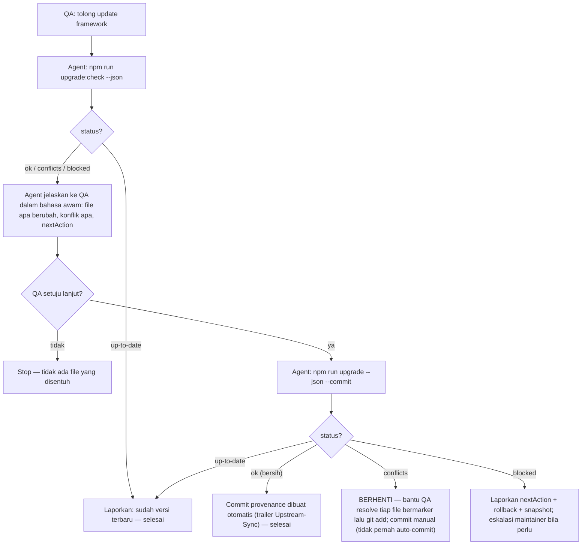
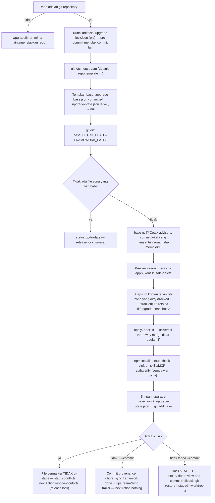
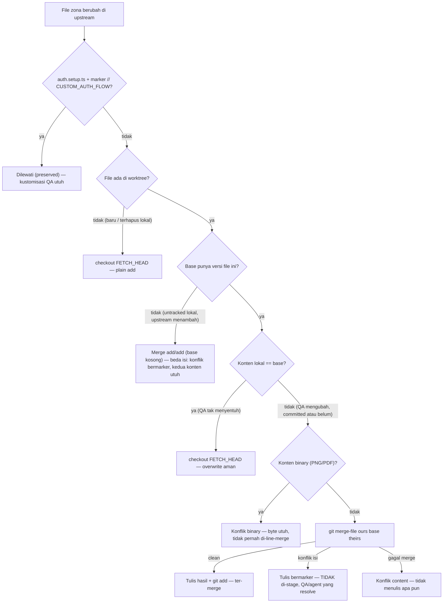
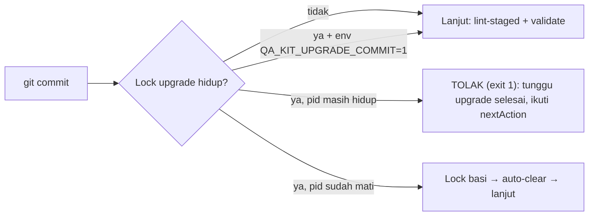

# Alur Upgrade Framework (v2)

Dokumen ini memvisualkan cara kerja `npm run upgrade` versi 2 (universal merge,
committed base, safety snapshot, `--commit`, commit-lock). Prinsipnya satu
kalimat: **QA tidak pernah perlu commit WIP-nya untuk bisa upgrade, dan tidak ada
keadaan lokal yang bisa hilang diam-diam** — engine yang menyelamatkan, hook yang
menahan, commit yang mendurasi.

Protokol lengkap untuk chat agent: [AGENTS.md](../AGENTS.md) → "Update / upgrade
framework". Panduan pemulihan kalau ada yang terasa hilang: bagian **🛟 Recovery**
di [TROUBLESHOOTING.md](TROUBLESHOOTING.md).

---

## 1. Siapa mengerjakan apa (protokol agent-first)

QA non-coder menjalankan upgrade lewat chat agent. Keputusan commit hanya ada
dua: **bersih → otomatis**, **konflik → tidak pernah otomatis**.

---

## 2. Alur engine saat `npm run upgrade`

Perhatikan tiga pilar keamanan di tengah alur: **lock** (tidak ada dua mutasi
bersamaan, commit lain ditolak hook), **snapshot** (keadaan pra-mutasi selalu
pulih), dan **universal merge** (tidak ada overwrite buta).

---

## 3. Keputusan per file (universal three-way merge)

Base merge = base tercatat ?? HEAD — jadi **setiap kasus punya jalur**, tanpa
hard-block dan tanpa overwrite buta. File QA di luar `FRAMEWORK_PATHS`
(requirements, specs, tests buatan QA) tidak pernah muncul di sini.

**File yang dihapus upstream:** dihapus juga (`git rm`) hanya bila konten lokal
masih sama dengan base **dan** file itu memang pernah ada di riwayat upstream —
file buatan QA yang kebetulan berada di dalam zona **tidak pernah** ikut
terhapus. File yang sudah dimodifikasi QA → **kept** (dilaporkan, dibiarkan).

---

## 4. Commit guard (hook pre-commit)

Selama upgrade memegang lock, commit lain ditahan mekanis — agent tidak bisa
membekukan keadaan setengah jadi, kecuali commit itu milik upgrade sendiri.

---

## 5. Jaminan keamanan — peta cepat

| Yang dijamin                                  | Mekanisme                                                    | Dipin oleh                  |
| --------------------------------------------- | ------------------------------------------------------------ | --------------------------- |
| WIP QA tidak perlu di-commit untuk upgrade    | Universal merge; dirty worktree tidak pernah memblokir       | harness `framework-upgrade` |
| Konten lokal tidak hilang diam-diam           | Merge tiga-arah + snapshot pra-apply + advisory commit lokal | `npm run test:upgrade`      |
| File QA di dalam zona tidak ikut terhapus     | Tiebreaker riwayat upstream (`upstreamHistoryHasFile`)       | harness                     |
| Hasil sync tidak menggantung staged           | `--commit` otomatis saat bersih (konflik tidak pernah)       | harness                     |
| Tidak ada commit liar di tengah upgrade       | Lock + pre-commit guard (fail-open bila guard error)         | harness                     |
| Base akurat di setiap clone/laptop            | `.upgrade-base.json` committed (pola Copier/cruft)           | harness                     |
| Marker `// CUSTOM_AUTH_FLOW` selalu dihormati | `shouldPreserveGeneratedFile` — line-anchored                | harness                     |

Semua jaminan di atas dipin `npm run test:upgrade` (38 checks, bagian dari
`quality:check-rules`) — perubahan masa depan yang merusaknya membuat gate
merah dulu, bukan QA yang kena.
